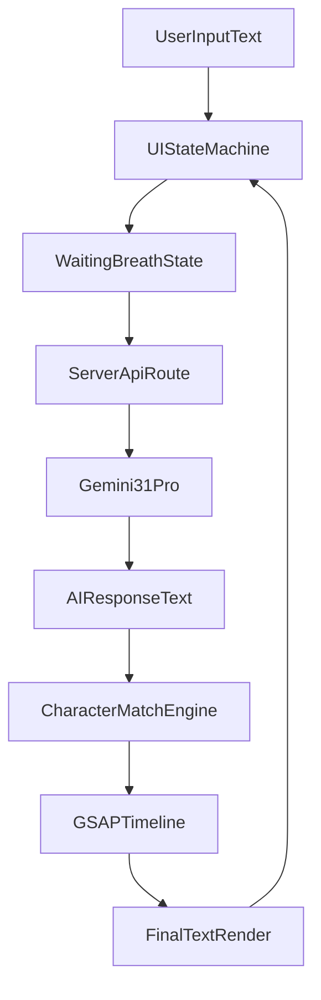

# TextAlchemy MVP 实施计划

## 目标与范围
- 交付一个可运行的 MVP：输入一句话，回车后进入等待态，调用 Gemini 生成同语种回应，并以字符重组动画呈现结果。
- 架构采用“前端 + 后端代理”，保证 API Key 不暴露在浏览器。
- 覆盖桌面与移动端响应式、核心视觉风格与关键动效手感。

## 方案总览

## 实施步骤
1. 项目骨架与依赖
- 初始化/确认 Vite + React 项目结构。
- 安装并配置依赖：`tailwindcss`、`gsap`、`@google/genai`（或官方 Google AI SDK 对应包）、`express`（若用 Node 代理）及基础中间件。
- 规划目录：前端 `src/`，后端 `server/`，环境变量在 `.env`。

2. 视觉与排版落地（Playful Minimalism）
- 在全局样式中定义背景 `#FDF5E6`、主文字 `#2D2D2D`、衬线字体栈（优先 `Noto Serif SC`，回退 `Georgia/Songti`）。
- 搭建核心容器：桌面端居中并限制 `max-width: 450-500px`；移动端横向自适应并保留边距。
- 输入框实现“无边框、无背景、无轮廓”，占位符文案“想说什么，就说吧”并设浅灰半透明。

3. 交互状态机与可用性
- 定义状态：`idle`、`typing`、`waiting`、`morphing`、`result`。
- 实现页面任意点击自动 focus 输入框。
- 捕获 `Enter` 提交，进入等待态（文本呼吸/微颤）。
- 结果态支持“重置/再次输入”触发下一轮。

4. AI 代理接口与 Prompt 固化
- 在后端新增 Gemini 调用接口（如 `POST /api/alchemy`），只接收用户文本并返回一句回应。
- 将你提供的 System Prompt 固化在服务端，强制同语种回复、15-20 字（英文对应约 15-20 letters/short-length response）与“尽量复用原字符”约束。
- 加入基础容错：超时、空返回、风格兜底文案（避免前端卡死）。

5. 字符重组算法与动画实现
- 设计字符级映射：按字符与出现序号（occurrence index）匹配，解决重复字符错配问题。
- 将字符分为三类：可复用字符（移动）、旧字符（淡出）、新增字符（淡入）。
- 用 GSAP 构建时间线：位移主动画 `1.0s-1.5s`，缓动优先 `back.out(1.7)` 或 `power2.inOut`，控制路径清晰不乱序。

6. 响应式与体验打磨
- 保证桌面“仪式感”中心布局与移动端可输入性。
- 动态字号策略：输入长度增长时微缩字号，维持单行稳定展示。
- 补齐微交互：加载态、禁用重复提交、失败提示不打断重试。

7. MVP 验收与最小测试
- 手测核心流程：输入→回车→等待态→重组动画→结果→再次输入。
- 测试中英文输入、重复字符句子、空格与标点场景。
- 验收视觉指标：颜色、字体、居中、占位符、动画时长与手感符合 PRD。

## 关键文件规划（建议）
- 前端入口与页面：[`src/App.tsx`](src/App.tsx)
- 样式与主题变量：[`src/index.css`](src/index.css)
- 字符映射算法：[`src/lib/charMorph.ts`](src/lib/charMorph.ts)
- 动画编排：[`src/lib/morphAnimation.ts`](src/lib/morphAnimation.ts)
- API 客户端：[`src/lib/api.ts`](src/lib/api.ts)
- 后端服务入口：[`server/index.ts`](server/index.ts)
- Gemini 调用封装：[`server/services/gemini.ts`](server/services/gemini.ts)
- 环境变量示例：[`.env.example`](.env.example)

## 里程碑与验收标准
- M1（UI 完成）：页面样式与输入体验符合视觉规范。
- M2（AI 可用）：后端代理稳定返回符合约束的回复。
- M3（动画完成）：字符重组动画稳定、重复字符无错位。
- M4（MVP 验收）：完整流程可重复使用，移动端可正常操作。

